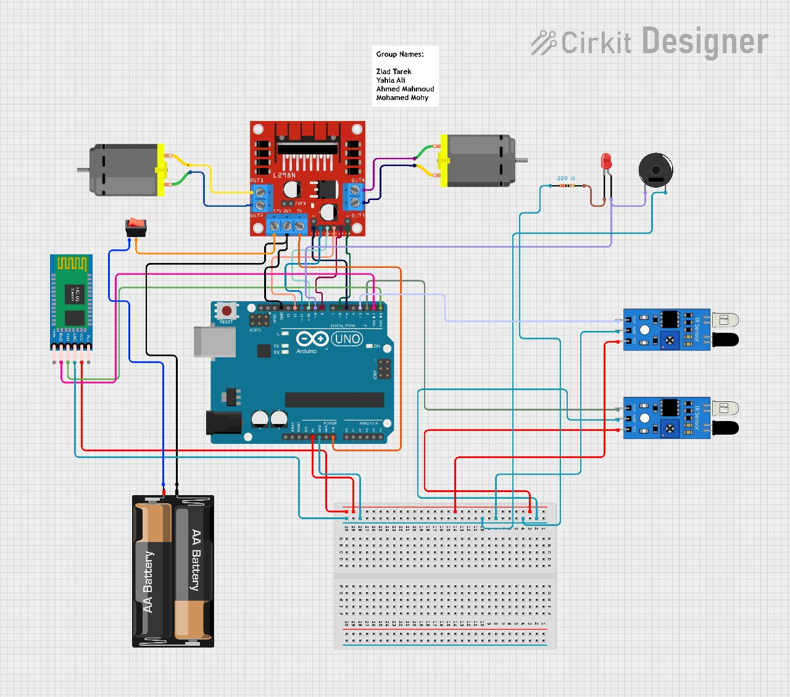

# Bluetooth-controlled-RC-with-Auto-brake-System-BCRCABS

This is a C++ project for AVR microcontrollers, specifically designed for a robot with two motors and a Bluetooth module for remote control. The robot can move forward, backward, turn right, and turn left. It also has a stop function.

## Features

- **Motor control**: The robot uses two motors, each controlled by three pins (forward, backward, and speed).
- **Bluetooth control**: The robot can be controlled remotely via Bluetooth. It listens for commands and moves accordingly.
- **Obstacle detection**: The robot can detect obstacles and stop or change direction accordingly.
- **Signal generation**: The robot can generate a signal when it detects an obstacle.

## Code Structure

- `setSpeed(unsigned char spd1 , unsigned char spd2)`: Sets the speed of the two motors.
- `setmot()`: Initializes the motor control pins and sets up PWM for speed control.
- `backward()`, `forward()`, `right()`, `left()`, `stop()`: Control the movement of the robot.
- `initBluetooth()`: Initializes the UART for Bluetooth communication.
- `readBluetoothCommand()`: Checks if a command is available from Bluetooth and returns it.
- `enableSig()`, `disableSig()`: Enable and disable the signal generation.
- `setObsDet()`: Sets up the pins for obstacle detection.
- `main()`: The main function. It initializes the robot and enters a loop where it listens for Bluetooth commands and checks for obstacles.

## Usage

Upload the code to your AVR microcontroller (the code was written for a 16 MHz clock). Connect your motors and Bluetooth module to the appropriate pins (see the `#define` statements at the top of the code for the pin numbers). You can then control the robot via Bluetooth. The robot will also react to obstacles by stopping and generating a signal.

## Dependencies

This project uses the AVR IO, delay, and interrupt libraries. Make sure these are available in your development environment.

## Authors

Ahmed Abdelazim 

Mohamed Mohy

Yehia Ali

Zeyad Omar

### Circuit 

